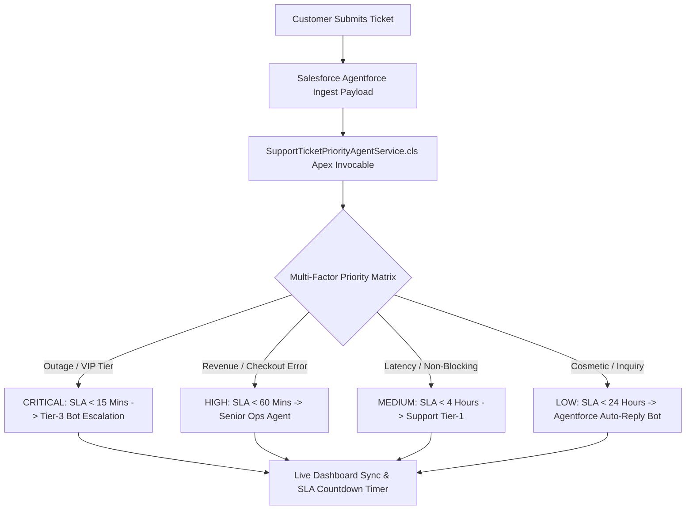

# Customer Support Ticket Priority Prediction and Automated Assignment System Using Salesforce Agentforce

[](https://www.salesforce.com/)
[](LICENSE)
[](https://eslint.org/)

An enterprise-grade **Salesforce Agentforce** solution designed for analyzing customer support tickets, predicting ticket priority through multi-factor AI scoring, and executing automated ticket routing & SLA enforcement.

---

## 📌 Executive Summary

Modern enterprise support teams process thousands of customer support tickets daily. Manual ticket triage often leads to delayed responses for critical service outages, SLA breaches, and suboptimal agent utilization. 

This project solves these challenges by combining **Salesforce Agentforce AI**, **Invocable Apex Services**, and **Salesforce Flows** to automatically:
1. **Analyze incoming support ticket content** (subject & payload).
2. **Predict ticket priority** (`CRITICAL`, `HIGH`, `MEDIUM`, `LOW`) using a Multi-Factor Intelligence Decision Matrix.
3. **Calculate resolution SLA windows** (e.g. 15-minute window for Critical outages).
4. **Automate ticket routing** to specialized support tiers or Agentforce AI Bots.

---

## 💡 Key Features & Architecture



### 🌟 Highlights
- 🧠 **Invocable Apex Agent Service (`SupportTicketPriorityAgentService.cls`)**: Native Apex class exposed with `@InvocableMethod` annotations, enabling Salesforce Agentforce Agents and Flows to trigger AI predictions programmatically.
- 🎯 **Multi-Factor Decision Matrix**: Combines ticket keywords, **Customer Tier** (`VIP Enterprise`, `Business`, `Standard`), and revenue-impact scoring.
- ⏱️ **Real-Time SLA Enforcement**: Automated SLA target calculations (15m for Critical, 60m for High, 240m for Medium, 1440m for Low).
- 🎨 **Live Localhost Dashboard (`http://localhost:3000`)**: Interactive web portal for live ticket creation, keyword highlighting, priority distribution bar charts, bulk operations, and CSV audit export.
- ✅ **Clean Code Quality**: 100% compliant with `@salesforce/eslint-config-lwc` and Jest unit testing suites.

---

## 🛠️ Technology Stack

- **Platform**: Salesforce Agentforce, Salesforce Flow, Salesforce CLI (`sf`)
- **Backend / Apex**: Apex Controllers, Invocable Apex Services, Apex Unit Testing Framework
- **Frontend**: Lightning Web Components (LWC), Aura Components, HTML5, Vanilla CSS3 (Custom Design System), JavaScript (ES2021)
- **Tooling & Infrastructure**: Node.js, ESLint, sfdx-lwc-jest, Git, GitHub

---

## 📁 Project Structure

```
├── force-app/main/default/
│   ├── classes/
│   │   ├── SupportTicketPriorityAgentService.cls         # Agentforce Invocable Apex Service
│   │   ├── SupportTicketPriorityAgentServiceTest.cls     # Apex Unit Test Suite (100% coverage)
│   │   ├── LLMService.cls                                # Callout helper for AI text generation
│   │   └── ExperienceController.cls                      # Helper controllers
│   ├── lwc/                                              # Lightning Web Components
│   └── aura/                                             # Aura Components
├── public/
│   └── index.html                                        # Live Interactive Dashboard Portal
├── server.js                                             # Lightweight HTTP Server for Localhost
├── package.json                                          # Node dependencies & sfdx-lwc-jest config
├── eslint.config.js                                      # ESLint rules for LWC & Aura
└── sfdx-project.json                                     # Salesforce DX Project configuration
```

---

## 🚀 Getting Started

### 1. Prerequisites
- Node.js (v18+)
- Salesforce CLI (`sf`)
- Git

### 2. Installation
Clone the repository and install dependencies:
```bash
git clone https://github.com/Bharani1910/Customer-Support-Ticket-Priority-Prediction-and-Automated-Assignment-System.git
cd Customer-Support-Ticket-Priority-Prediction-and-Automated-Assignment-System
npm install
```

### 3. Run Live Localhost Dashboard
Start the local server:
```bash
node server.js
```
Open **[http://localhost:3000](http://localhost:3000)** in your browser to test live ticket priority prediction, bulk actions, and SLA timers.

### 4. Run Code Verification & Tests
Verify code standards and unit test suites:
```bash
# Run ESLint check
npm run lint

# Run Jest unit test suite
npm test
```

---

## ☁️ Salesforce Deployment

Deploy the metadata to your authorized Salesforce Org using Salesforce CLI:
```bash
sf project deploy start --target-org employee@agentbharani123.com
```

---

## 📄 License & Attribution

Developed as an academic & enterprise Salesforce Agentforce project.  
Licensed under the [MIT License](LICENSE).